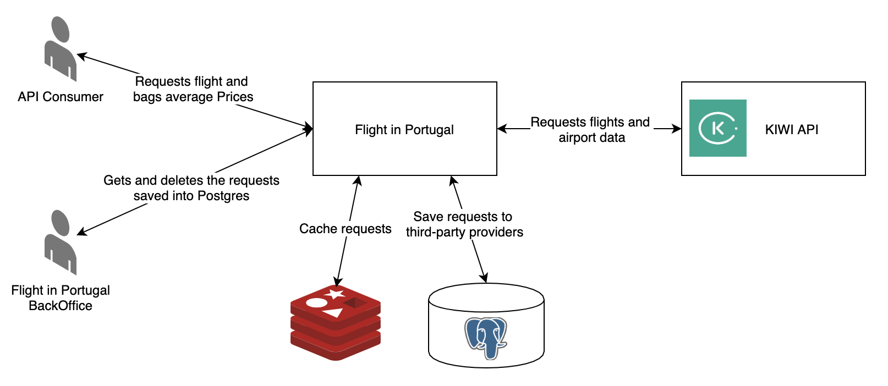

# Flight in Portugal API

This project provides a API for search average price of direct flights between Oporto and Lisbon (vice-versa).

## Architecture



## Endpoints

In this version one our API provides three REST endpoints:

| Method | Resource 		     | Description                                                  |
|--------|-----------------------|----------------------------------------------------------|
| GET    | /v1/flights/avg-price | Returns flights average price                            |
| GET    | /v1/requests          | Returns all requests made to third-party providers       |
| DELETE | /v1/requests          | Deletes all saved requests made to third-party providers |
                     
### GET /v1/flights/avg-price

In this get operation the parameters `fly_to` `fly_from` and `currency` are required.

Request example:
```
curl -X GET "http://localhost:8080/v1/flights/avg-price?currency=EUR&date_from=01%2F01%2F2020&date_to=01%2F01%2F2020&fly_from=OPO&fly_to=LIS" -H "accept: application/json"
```
Response example:
```json
{
  "avg_price": 108.15,
  "bags_avg_price": {
    "first": 30.65,
    "second": 92.86
  },
  "currency_by_eur": 1,
  "airport_name_from": "Porto",
  "airport_name_to": "Lisbon Portela"
}
```

### GET /v1/requests

Request example:
```
curl -X GET "http://localhost:8080/v1/requests" -H "accept: application/json"
```
Response example:
```json
{
  "data": [
    {
      "currency": "EUR",
      "fly_from": "OPO",
      "fly_to": "LIS",
      "date_from": "01/01/2021",
      "date_to": "01/01/2021",
      "created_at": "2019-11-17T11:16:29.903894"
    },
    {
      "currency": "EUR",
      "fly_from": "LIS",
      "fly_to": "OPO",
      "created_at": "2019-11-17T11:16:46.887188"
    }
  ]
}
```

### DELETE /v1/requests

Request example:
```
curl -X DELETE "http://localhost:8080/v1/requests" -H "accept: application/json"
```

## Api Errors

Here is the link to our API errors [documentation](documentation/Errors.md).

Our API uses a third-party services, you can turn-off your internet to simulate the error handling in case of third-party services unavailable.

## Api Logs

All requests and responses that pass for our API are logged using interceptor and controllerAdvice. 

## Run 

For running the project locally, you need to start the Postgres and Redis databases:
```
docker-compose up
```

Then start the spring application:
```
mvn spring-boot:run
```

## Cache 

Our application uses Redis for cache the requests, you can use the redis-cli tool for check them:
```         
redis-cli
KEYS '*'
```
For test proposes the time-to-live for the cache is set to 1 minute. You can change it in the application.properties file:
```
spring.cache.redis.time-to-live=60000
```

## Try it out

You can try out the API endpoints through Swagger-UI:
```
http://localhost:8080/swagger-ui.html
``` 

## Technologies
Below the technologies used in this project:

* Java 11 - programming language (current long-term support release version). 
* Spring Boot Starter Web - 
* Spring Cloud OpenFeign - Web service clients.
* Spring Boot Data JPA - 
* Redis - Cache database.
* Postgres - Requests database.
* MockMVC - Integration tests.
* JUnit5 - Unit tests.
* Swagger - Api documentation and try-out.
* Lombok - Avoid boilerplate java code.
* MapStruct - Avoid boilerplate copy/past values code.
* Docker - Create a file for build a project image.
* Docker-Compose - Make easy start the project databases in any environment.

## Next Steps

Here I left some ideas for improvements in our project:
- Add security at least in the get and delete request routes.
- Change the requests database to MongoDB if we need to save all requests and not only the third-party providers, because with MongoDB we will have the flexibility of a NoSQL(schemaless) database.
- Add test containers for unit and integration tests.
- Migrate configurations to a spring-config-server.
